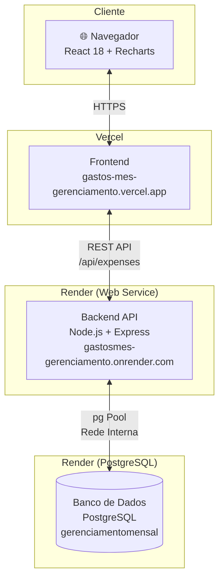
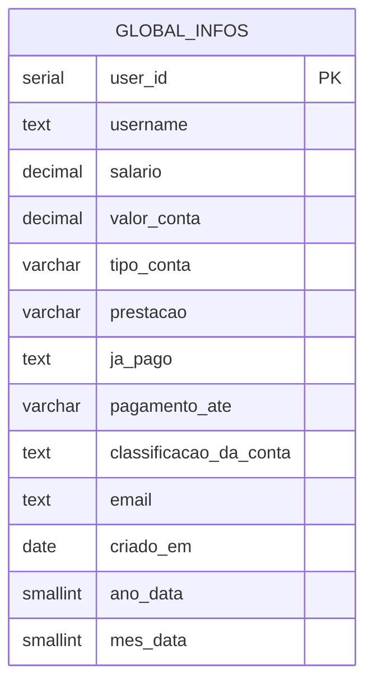
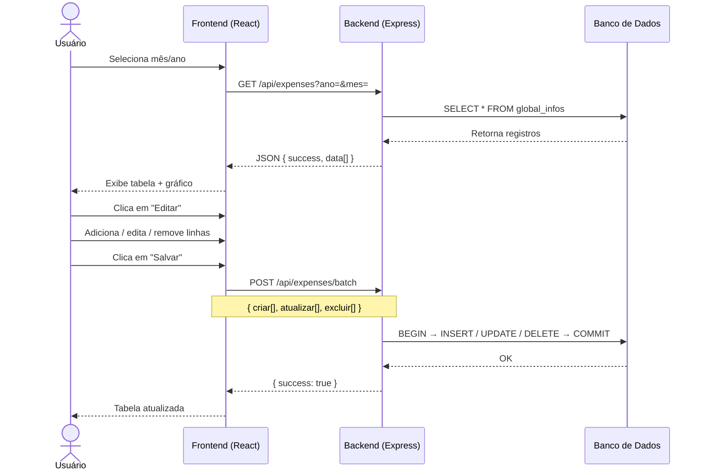
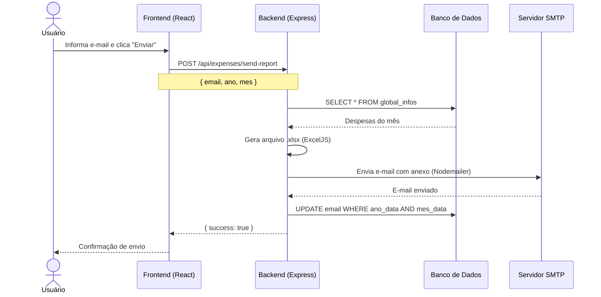

# Controle de Gastos Mensais


Aplicação fullstack para controle de despesas mensais com visualização gráfica, edição inline e envio de relatório em `.xlsx` por e-mail.

**[▶ Acessar a aplicação em produção](https://gastos-mes-gerenciamento.vercel.app/)**

---

## Sumário

- [Sobre o Projeto](#sobre-o-projeto)
- [Levantamento de Requisitos](#levantamento-de-requisitos)
- [Arquitetura do Sistema](#arquitetura-do-sistema)
- [Diagrama Entidade-Relacionamento](#diagrama-entidade-relacionamento)
- [Fluxos Principais](#fluxos-principais)
- [Funcionalidades](#funcionalidades)
- [Tecnologias](#tecnologias)
- [Estrutura do Projeto](#estrutura-do-projeto)
- [Como Rodar Localmente](#como-rodar-localmente)
- [API — Endpoints](#api--endpoints)
- [Banco de Dados](#banco-de-dados)
- [Colaboradores](#colaboradores)

---

## Sobre o Projeto

Sistema desenvolvido para atender a necessidade de controlar despesas mensais de forma simples e visual. O usuário pode registrar contas, acompanhar pagamentos e ter uma visão clara de quanto sobra do salário ao final do mês — com navegação por mês/ano e geração de relatório em planilha.

---

## Levantamento de Requisitos

### Requisitos Funcionais

| ID | Requisito |
|----|-----------|
| RF01 | O sistema deve permitir cadastrar despesas por mês e ano |
| RF02 | O sistema deve permitir editar e excluir despesas existentes |
| RF03 | O sistema deve calcular automaticamente o total gasto e a sobra do salário |
| RF04 | O sistema deve exibir um gráfico de distribuição por categoria |
| RF05 | O sistema deve permitir marcar contas como pagas |
| RF06 | O sistema deve indicar contas com vencimento no dia 10 |
| RF07 | O sistema deve gerar e enviar relatório `.xlsx` por e-mail |
| RF08 | O sistema deve persistir o e-mail informado para uso futuro |
| RF09 | O sistema deve permitir navegar entre diferentes meses e anos |
| RF10 | O sistema deve salvar o salário informado para o período selecionado |

### Requisitos Não Funcionais

| ID | Requisito |
|----|-----------|
| RNF01 | A interface deve ser responsiva (mobile e desktop) |
| RNF02 | As operações de criação, edição e exclusão devem ser realizadas em lote (batch) para otimizar requisições |
| RNF03 | O backend deve validar todos os dados antes de persistir no banco |
| RNF04 | A aplicação deve estar disponível em produção via HTTPS |
| RNF05 | O banco deve garantir integridade referencial e validação de domínio via constraints |

---

## Arquitetura do Sistema



---

## Diagrama Entidade-Relacionamento



---

## Fluxos Principais

### Visualização e Edição de Despesas



### Envio de Relatório por E-mail



---

## Funcionalidades

- Cadastro e edição inline de despesas por mês/ano
- Controle de salário e cálculo automático de sobra
- Gráfico donut de distribuição por categoria
- Marcação de contas pagas e contas com vencimento no dia 10
- Classificação de despesas (Moradia, Alimentação, Transporte, Saúde, Animais, Igreja, Imprevisto)
- Suporte a parcelamentos (ex: `3/12`)
- Geração e envio de relatório `.xlsx` por e-mail
- Navegação entre meses e anos

---

## Tecnologias

| Camada | Tecnologias |
|--------|-------------|
| Frontend | React 18, Recharts |
| Backend | Node.js, Express 4 |
| Banco de dados | PostgreSQL |
| Relatório | ExcelJS (.xlsx) |
| E-mail | Nodemailer (SMTP) |
| Deploy Frontend | Vercel |
| Deploy Backend | Render |

---

## Estrutura do Projeto

```
├── backend/
│   ├── src/
│   │   ├── app.js                        # Entrada do servidor Express
│   │   ├── config/
│   │   │   └── database.js               # Pool de conexão PostgreSQL
│   │   ├── controllers/
│   │   │   └── expenseController.js      # Lógica de negócio + geração de XLSX
│   │   ├── routes/
│   │   │   ├── index.js
│   │   │   └── expenseRoutes.js
│   │   ├── services/
│   │   │   └── expenseService.js         # Queries ao banco de dados
│   │   └── utils/
│   │       └── response.js               # Helpers de resposta HTTP
│   ├── .env.example
│   └── package.json
├── frontend/
│   ├── src/
│   │   ├── App.js
│   │   └── components/
│   │       ├── ControleGastosMensais.jsx # Componente principal
│   │       └── ControleGastosMensais.css
│   ├── .env.example
│   └── package.json
└── database/
    └── scripts/
        ├── 01-create-table.sql           # Criação da tabela
        ├── 02-populando-dados.sql        # Dados de exemplo
        └── 03-update-tabela.sql
```

---

## Como Rodar Localmente

### Pré-requisitos

- Node.js 18+
- PostgreSQL rodando localmente

### 1. Banco de dados

```bash
psql -h localhost -U postgres -d seu_banco -f database/scripts/01-create-table.sql
```

### 2. Backend

```bash
cd backend
npm install
cp .env.example .env
```

Edite o `.env` com suas credenciais:

```env
NODE_ENV=development
PORT=5000

DB_HOST=localhost
DB_PORT=5432
DB_NAME=seu_banco
DB_USER=seu_usuario
DB_PASSWORD=sua_senha

FRONTEND_URL=http://localhost:3000

EMAIL_HOST=smtp.gmail.com
EMAIL_PORT=587
EMAIL_SECURE=false
EMAIL_USER=seu_email@gmail.com
EMAIL_PASS=xxxx xxxx xxxx xxxx
EMAIL_FROM=Controle de Gastos <seu_email@gmail.com>
```

```bash
npm run dev
```

### 3. Frontend

```bash
cd frontend
npm install
cp .env.example .env   # REACT_APP_API_URL=http://localhost:5000/api
npm start
```

Acesse: `http://localhost:3000`

---

## API — Endpoints

| Método | Rota | Descrição |
|--------|------|-----------|
| GET | `/api/expenses?ano=&mes=` | Busca despesas do mês/ano |
| POST | `/api/expenses/batch` | Cria, atualiza e exclui em lote |
| PUT | `/api/expenses/salary` | Atualiza o salário do mês |
| POST | `/api/expenses/send-report` | Gera `.xlsx` e envia por e-mail |
| DELETE | `/api/expenses/:id` | Remove uma despesa |
| GET | `/health` | Health check do servidor |

---

## Banco de Dados

```sql
CREATE TABLE global_infos (
    user_id                SERIAL PRIMARY KEY,
    username               TEXT,
    salario                DECIMAL(10, 2),
    valor_conta            DECIMAL(10, 2),
    tipo_conta             VARCHAR(30),
    prestacao              VARCHAR(15),
    ja_pago                TEXT,
    pagamento_ate          VARCHAR(10),
    classificacao_da_conta TEXT,
    email                  TEXT,
    criado_em              DATE DEFAULT CURRENT_DATE,
    ano_data               SMALLINT NOT NULL,
    mes_data               SMALLINT NOT NULL,
    CONSTRAINT chk_mes_valido CHECK (mes_data BETWEEN 1 AND 12),
    CONSTRAINT chk_ano_valido CHECK (ano_data BETWEEN 2000 AND 2099)
);

CREATE INDEX idx_ano_mes    ON global_infos(ano_data, mes_data);
CREATE INDEX idx_tipo_conta ON global_infos(tipo_conta);
CREATE INDEX idx_ja_pago    ON global_infos(ja_pago);
```

---

## Colaboradores

| Colaborador | Contribuição |
|-------------|-------------|
| [João Victor Peretti](https://github.com/jvperetti) | UX/UI — definição de paleta de cores, usabilidade e experiência do usuário no frontend |
